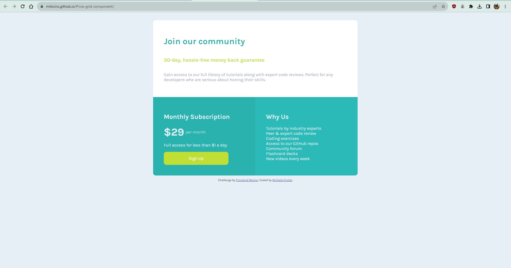

# Frontend Mentor - Single price grid component solution

This is a solution to the [Single price grid component challenge on Frontend Mentor](https://www.frontendmentor.io/challenges/single-price-grid-component-5ce41129d0ff452fec5abbbc). Frontend Mentor challenges help you improve your coding skills by building realistic projects.

## Table of contents

- [Overview](#overview)
  - [The challenge](#the-challenge)
  - [Screenshot](#screenshot)
  - [Links](#links)
- [My process](#my-process)
  - [Built with](#built-with)
  - [What I learned](#what-i-learned)
  - [Continued development](#continued-development)
  - [Useful resources](#useful-resources)
- [Author](#author)
- [Acknowledgments](#acknowledgments)

**Note: Delete this note and update the table of contents based on what sections you keep.**

## Overview

### The challenge

Users should be able to:

- View the optimal layout for the component depending on their device's screen size
- See a hover state on desktop for the Sign Up call-to-action

### Screenshot

### Links

- Solution URL: [Add solution URL here](https://www.frontendmentor.io/solutions/price-grid-component-aSZOazcVve)
- Live Site URL: [Add live site URL here](https://mikiciro.github.io/Price-grid-component/)

## My process

### Built with

- Semantic HTML5 markup
- CSS custom properties
- Flexbox
- Mobile-first workflow

### What I learned

This exercise helped me a lot to practice with flexbox and page sizing. It was also useful for learning how to refactor code.

### Continued development

I will return to this exercise to practice CSS pseudo classes, so that I can improve the code.

### Useful resources

- [Resource 1](https://stackoverflow.com/questions/41789278/first-child-full-width-in-flexbox) - I found this example solution with flexbox very useful for understanding how to set up the container and the other two containers

## Author

- Frontend Mentor - [@Mikiciro](https://www.frontendmentor.io/profile/Mikiciro)

